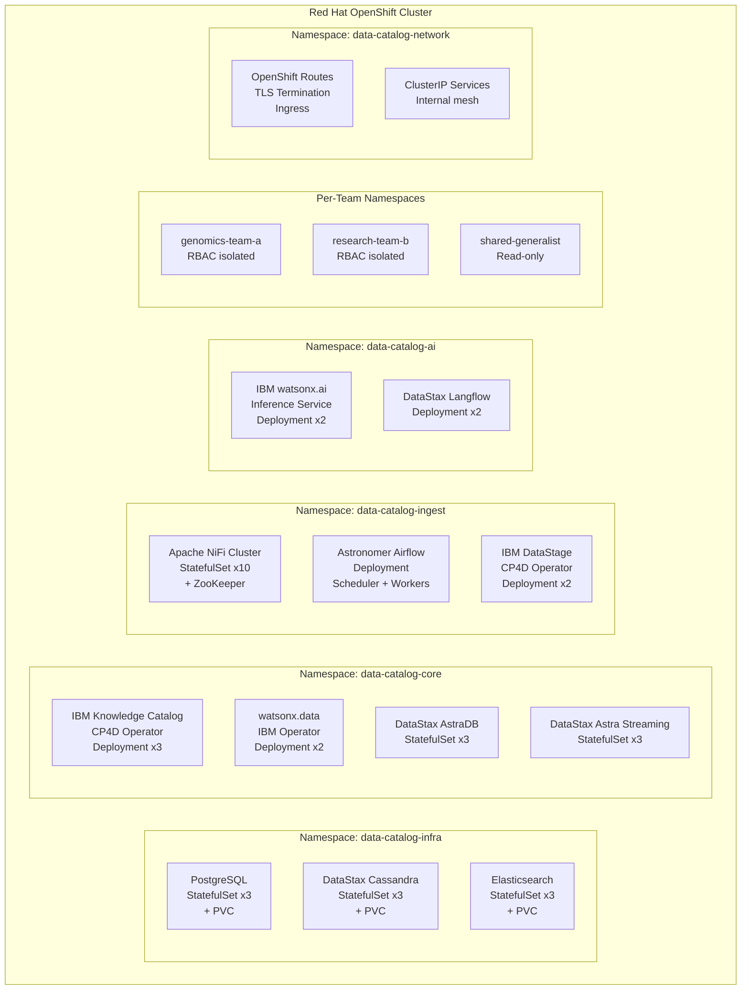
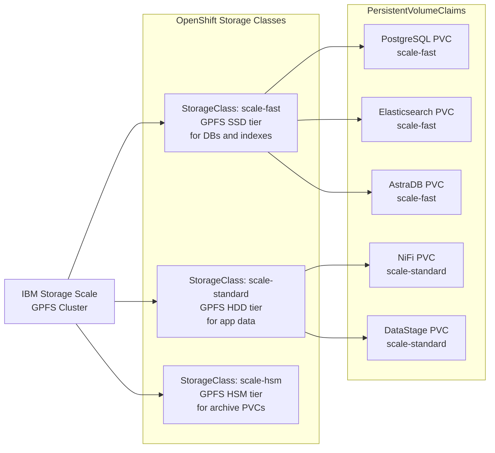
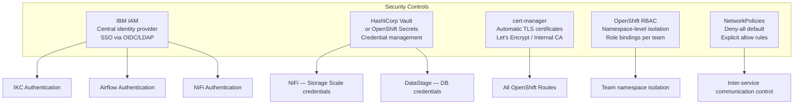

# OpenShift Deployment

## Deployment Architecture on Red Hat OpenShift

All platform components run as containerised workloads inside the OpenShift cluster. No external SaaS dependencies — full on-premises deployment.

---

## Namespace Strategy

---

## Component Pod Topology

| Component | Workload Type | Replicas | Storage | Notes |
|---|---|---|---|---|
| **IBM Knowledge Catalog** | CP4D Deployment | 3 | PVC via CP4D operator | Managed by CP4D operator |
| **watsonx.data** | IBM Operator Deployment | 2 | PVC (Scale-backed) | Managed by watsonx.data operator |
| **Apache NiFi** | StatefulSet | 10 | PVC per node | ZooKeeper for cluster state |
| **IBM DataStage** | CP4D Deployment | 2 | PVC via CP4D operator | Managed by CP4D operator |
| **watsonx.ai** | KServe InferenceService | 2 | Model store PVC | GPU nodes if available |
| **DataStax Langflow** | Deployment | 2 | Stateless + AstraDB backend | Horizontal scale |
| **DataStax AstraDB** | StatefulSet | 3 | PVC (Scale-backed) | Cassandra-based vector store |
| **DataStax Astra Streaming** | StatefulSet | 3 | PVC (Scale-backed) | Pulsar-based streaming |
| **Astronomer Airflow** | Deployment | 1 scheduler + N workers | PVC for DAG store | Astronomer Software operator |
| **PostgreSQL** | StatefulSet | 3 | PVC (Scale-backed) | Primary + 2 replicas |
| **Elasticsearch** | StatefulSet | 3 | PVC (Scale-backed) | IKC search backend |

---

## Storage Class Design

IBM Storage Scale serves as the backing PersistentVolume provider for all stateful workloads:

---

## Networking & Ingress

| Route | Target Service | TLS | Auth |
|---|---|---|---|
| `catalog.internal.org` | IBM Knowledge Catalog UI | ✅ TLS terminate | IBM IAM / LDAP |
| `api.catalog.internal.org` | IKC REST API | ✅ TLS terminate | OAuth2 / API Key |
| `nifi.internal.org` | NiFi UI | ✅ TLS terminate | OIDC |
| `airflow.internal.org` | Airflow UI | ✅ TLS terminate | OIDC |
| `langflow.internal.org` | Langflow NL UI | ✅ TLS terminate | IBM IAM |

---

## Security Architecture

---

## Operators Used

| Operator | Source | Manages |
|---|---|---|
| **IBM Cloud Pak for Data Operator** | IBM Operator Catalog | IKC, DataStage, watsonx.ai |
| **IBM watsonx.data Operator** | IBM Operator Catalog | watsonx.data, Hive Metastore |
| **Astronomer Operator** | Astronomer Software | Airflow deployment |
| **cert-manager Operator** | OperatorHub | TLS certificate lifecycle |
| **Crunchy Postgres Operator** | OperatorHub | PostgreSQL StatefulSet |
| **ECK Operator** | Elastic | Elasticsearch StatefulSet |

---

## Resource Estimates

| Namespace | CPU Request | Memory Request | Storage |
|---|---|---|---|
| `data-catalog-infra` | 48 cores | 192 GB | 20 TB PVC |
| `data-catalog-core` | 64 cores | 256 GB | 10 TB PVC |
| `data-catalog-ingest` | 80 cores | 320 GB | 5 TB PVC |
| `data-catalog-ai` | 32 cores + GPU | 128 GB | 2 TB PVC |
| **Total estimate** | **~224 cores** | **~896 GB** | **~37 TB PVC** |

!!! info "Sizing Note"
    These are initial estimates for 20PB at steady state. The NiFi cluster can scale down after the initial crawl is complete. GPU nodes are optional — watsonx.ai can run on CPU with reduced throughput.
