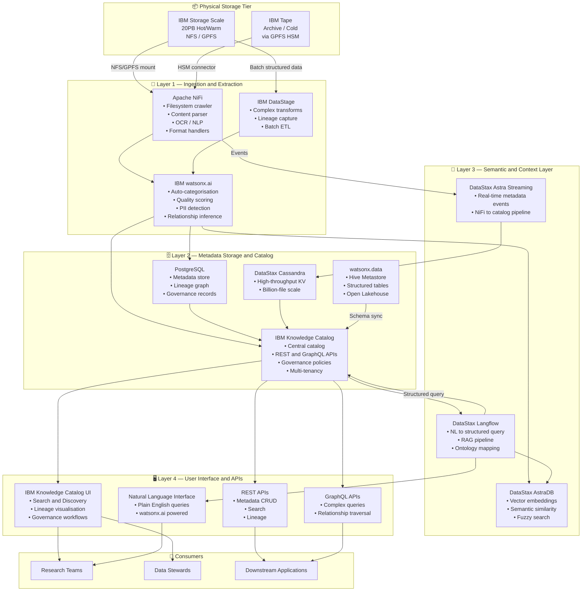
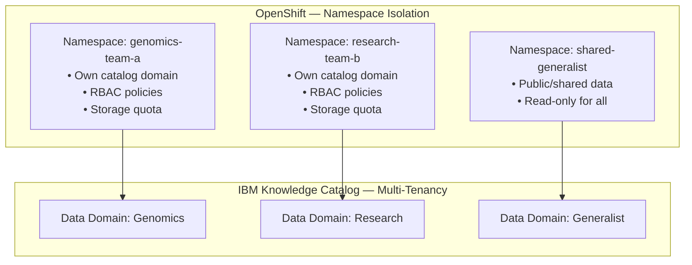
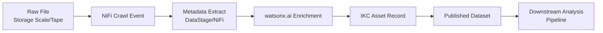

# Architecture Overview

## High-Level System Architecture

The platform is organised into **five horizontal layers**, each running as containerised workloads on Red Hat OpenShift, communicating with physical storage at the base.

---

## Layer Responsibilities

### Layer 1 — Ingestion & Extraction

| Component | Role |
|---|---|
| **Apache NiFi** | Filesystem crawl, file content extraction, format routing, tape stub detection, provenance chain |
| **IBM DataStage** | Structured/tabular ETL, complex transformation, deep lineage capture |
| **IBM watsonx.ai** | AI-powered enrichment — auto-classification, PII detection, quality scoring, relationship inference |
| **Astronomer Airflow** | Orchestrates when NiFi runs re-scans, schedules watsonx.ai batch jobs, manages tape recall windows |

### Layer 2 — Metadata Storage & Catalog

| Component | Role |
|---|---|
| **IBM Knowledge Catalog** | Primary catalog for ALL asset types — files, tables, models; governance, lineage, multi-tenancy |
| **IBM watsonx.data + Hive Metastore** | Structured/tabular catalog for Parquet, Iceberg, CSV — syncs schemas into IKC |
| **PostgreSQL** | Relational metadata persistence (IKC and OpenMetadata native backend) |
| **DataStax Cassandra** | High-throughput key-value metadata lookups at billion-file scale |

### Layer 3 — Semantic & Context Layer

| Component | Role |
|---|---|
| **DataStax Langflow** | Visual RAG pipeline builder — translates natural language queries to structured catalog queries |
| **DataStax AstraDB** | Managed vector store — stores content embeddings, powers similarity and semantic search |
| **DataStax Astra Streaming** | Real-time event backbone — streams metadata events from NiFi into the catalog |

!!! note "DataStax & IBM"
    DataStax was acquired by IBM in 2024 and is now part of **IBM watsonx.data Premium**. Langflow, AstraDB, and Astra Streaming are all available as IBM-native components within the watsonx.data premium tier.

### Layer 4 — User Interface & APIs

| Component | Role |
|---|---|
| **IBM Knowledge Catalog UI** | Primary interface for researchers and data stewards — browse, search, lineage, governance |
| **REST API** | `/api/v1/` — full CRUD for all asset types, programmatic metadata management |
| **GraphQL API** | Multi-hop relationship queries, complex entity graphs |
| **NL Interface** | Plain English querying via Langflow + watsonx.ai — for non-technical researchers |

---

## Multi-Tenancy Design

- **OpenShift RBAC** — enforces namespace-level isolation per team
- **IKC Projects/Catalogs** — domain-level metadata access control
- **watsonx.ai** — queries filtered by user's team membership at inference time
- **Storage Scale ACLs** — file-level access control independent of catalog

---

## Data Lineage Model

All transitions are captured as lineage edges in IBM Knowledge Catalog's lineage graph — surfaced via the UI and REST lineage endpoint. IBM DataStage feeds deep column-level lineage for structured data.

---

## Non-Functional Requirements

| NFR | Target | Design Approach |
|---|---|---|
| **Crawl throughput** | 20PB initial in ≤ 30 days | 10-node NiFi cluster, parallel GPFS scan |
| **Incremental update latency** | < 5 minutes for new files | GPFS callbacks → NiFi event trigger |
| **Search response time** | < 1 second keyword search | IKC built-in Elasticsearch index |
| **Semantic search latency** | < 3 seconds | AstraDB ANN index, pre-computed embeddings |
| **API availability** | 99.9% | OpenShift pod replicas + health probes |
| **Metadata storage** | ~5–50 KB per file | PostgreSQL + partitioning; ~50TB metadata est. |
| **Security** | RBAC, TLS 1.3, no secrets in code | OpenShift Secrets, cert-manager, Vault |
| **Data residency** | On-premises only | All workloads inside OpenShift cluster |
