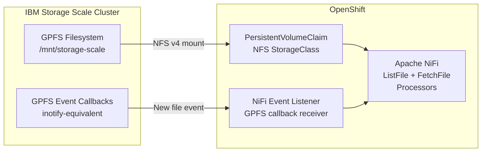
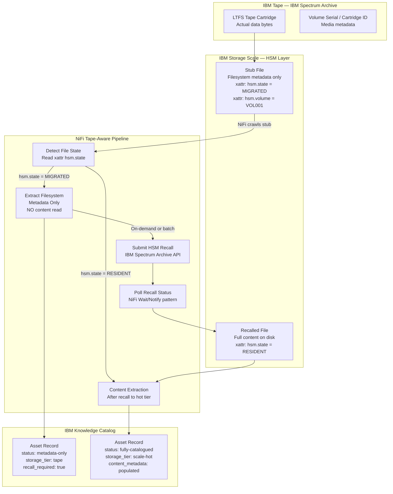
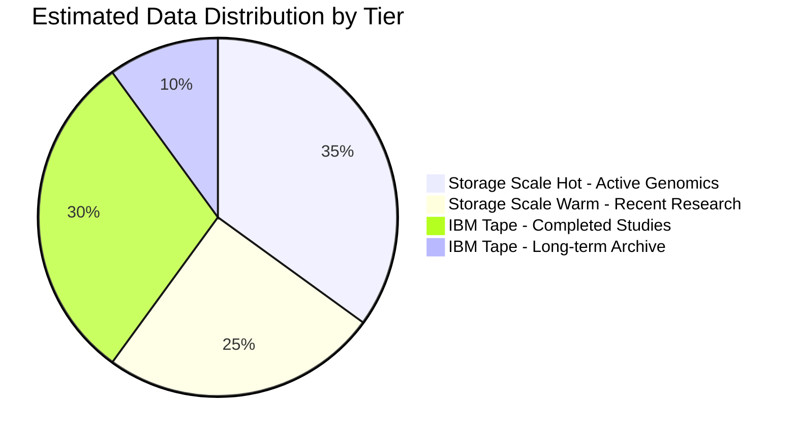

# Storage Integration

## IBM Storage Scale & IBM Tape Connectivity

The platform integrates with two physical storage tiers. Both are exposed to the OpenShift workloads via standard protocols — the ingestion layer treats them differently based on data temperature.

---

## Storage Tier Summary

| Tier | Product | Data Temperature | Access Protocol | Typical Data |
|---|---|---|---|---|
| **Hot / Warm** | IBM Storage Scale (GPFS) | Active, frequently accessed | NFS v4, GPFS-direct | Active genomics runs, recent research data |
| **Cold / Archive** | IBM Tape (IBM Spectrum Archive / LTFS) | Infrequently accessed | GPFS HSM (stub files) | Completed studies, archived experiments |

---

## IBM Storage Scale Integration



### Connection Details

| Parameter | Value |
|---|---|
| Protocol | NFS v4 / GPFS-direct |
| Mount Path | `/mnt/storage-scale` |
| OpenShift Access | PersistentVolume via NFS StorageClass |
| Event Trigger | GPFS policy callbacks on file create/modify |
| Crawl Mode | Full scan (initial) + event-driven (incremental) |

### Crawl Strategy

| Mode | Trigger | Use Case |
|---|---|---|
| **Full scan** | Scheduled via Airflow DAG | Initial 20PB ingestion; weekly reconciliation |
| **Event-driven** | GPFS callback on file create/modify | Real-time catalog updates for new data |
| **Priority crawl** | Airflow DAG by directory path | Urgent cataloguing of specific project data |

---

## IBM Tape Integration (IBM Spectrum Archive / LTFS)

IBM Tape integrates with Storage Scale via **HSM (Hierarchical Storage Management)**. Files on tape appear as **stub files** on the Storage Scale filesystem — small pointer files with full filesystem metadata but no content bytes.



!!! warning "Tape Access Design Principle"
    NiFi **must never** trigger a tape recall during the initial catalog crawl. Stub metadata (path, size, timestamps, HSM attributes) is catalogued immediately. Content extraction from tape happens only:

    - **On-demand** — when a user requests it via the catalog UI
    - **In scheduled batch windows** — via Airflow DAGs during off-peak hours, processing tape sequentially (not randomly)

    Random tape access is extremely expensive. Sequential batch recall is orders of magnitude more efficient.

### Tape Asset Metadata Schema

When a tape stub is catalogued, the following metadata is captured without any recall:

| Metadata Field | Source | Example |
|---|---|---|
| `file_path` | Filesystem | `/mnt/storage-scale/genomics/proj001/sample.bam` |
| `file_size` | Filesystem (stub) | `45.2 GB` |
| `created_date` | Filesystem | `2022-03-15T09:22:00Z` |
| `modified_date` | Filesystem | `2022-03-15T14:05:00Z` |
| `hsm_state` | xattr `hsm.state` | `MIGRATED` |
| `volume_serial` | xattr `hsm.volume` | `VOL004821` |
| `cartridge_id` | IBM Spectrum Archive API | `CART-A0042` |
| `ltfs_path` | IBM Spectrum Archive API | `/ltfs/vol004821/genomics/...` |
| `recall_sla_hours` | Policy config | `4` |
| `last_recalled` | Tracking record | `2023-11-01T02:00:00Z` |
| `content_catalogued` | Boolean flag | `false` |

---

## Data Type Distribution Across Tiers



| Data Category | Primary Tier | Archive Tier | Notes |
|---|---|---|---|
| Active sequencing runs | Storage Scale (hot) | — | Continuously written |
| Completed genomics projects | Storage Scale (warm) | IBM Tape | Migrated after project close |
| Raw research datasets | Storage Scale | IBM Tape | Policy-based HSM migration |
| Published / finalised data | IBM Tape | — | Read-only, long-term retention |
| Generalist data | Storage Scale | IBM Tape | Mixed per policy |

---

## Storage Scale Namespace Design

```yaml
Storage Scale Mount Layout:
├── /mnt/storage-scale/
│   ├── genomics/
│   │   ├── raw-reads/          # .fastq, .fasta — high volume
│   │   ├── alignments/         # .bam, .cram, .sam
│   │   ├── variants/           # .vcf, .bcf
│   │   ├── annotations/        # .gff, .gtf, .bed
│   │   └── arrays/             # .h5, .hdf5, .zarr
│   ├── research/
│   │   ├── tabular/            # .csv, .xlsx, .parquet
│   │   ├── documents/          # .pdf, .docx
│   │   ├── imaging/            # .tif, .czi, .dcm, .ome.tif
│   │   └── notebooks/          # .ipynb, .rds, .mat
│   └── generalist/
│       ├── structured/
│       ├── unstructured/
│       └── archives/           # .tar.gz, .zip
```
