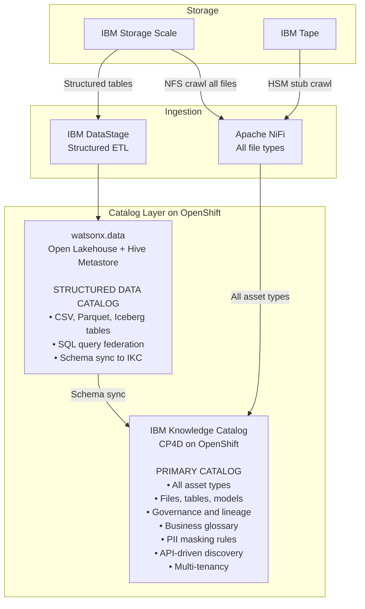
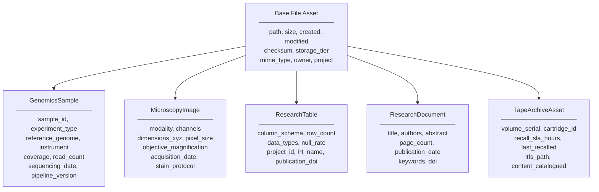

# Data Catalog

## IBM Knowledge Catalog + watsonx.data Open Lakehouse

The catalog layer uses a **hybrid strategy** — IBM Knowledge Catalog as the primary discovery interface for all asset types, and watsonx.data with Hive Metastore for structured/tabular data, with schema federation between the two.

---

## Options Evaluated

Three catalog options were evaluated. The trade-off analysis below informed the final recommendation.

### Option A — OpenMetadata

| Dimension | Assessment |
|---|---|
| **Primary purpose** | Data catalog, discovery, lineage, governance |
| **API** | Rich REST + GraphQL, well-documented |
| **UI** | Modern, purpose-built for data cataloguing |
| **File / unstructured asset support** | ✅ Supports custom asset types including raw files |
| **Lineage** | ✅ Strong visual lineage DAG |
| **Governance** | ✅ Tags, classifications, ownership, policies |
| **Multi-tenancy** | ✅ Teams, domains, roles |
| **IBM integration** | ⚠️ None native — requires custom connectors |
| **watsonx.data integration** | ⚠️ Not native |
| **Hive Metastore** | ❌ Different paradigm — not applicable |
| **OpenShift deployment** | ✅ Helm chart available |
| **Licence** | Open source Apache 2.0 |
| **Genomics / unstructured files** | ✅ Custom asset types cover this |
| **Maturity** | Medium — v1.x, growing community |

### Option B — watsonx.data Open Lakehouse + Hive Metastore

| Dimension | Assessment |
|---|---|
| **Primary purpose** | Query federation over structured/semi-structured data — tables, Parquet, ORC, Iceberg |
| **API** | Presto/Iceberg SQL APIs; REST management API |
| **UI** | watsonx.data console — table and bucket focused |
| **File / unstructured asset support** | ⚠️ Weak — designed for structured tabular/lakehouse assets, not raw genomics files |
| **Lineage** | ⚠️ Limited — table-level lineage only |
| **Governance** | ⚠️ Policy enforcement at query time — not full catalog governance |
| **Multi-tenancy** | ✅ Supported via IBM IAM |
| **IBM integration** | ✅ Native IBM product |
| **Hive Metastore** | ✅ Native — manages table schemas for structured data |
| **OpenShift deployment** | ✅ IBM Operator available |
| **Licence** | IBM commercial licence |
| **Genomics / unstructured files** | ❌ Hive Metastore catalogues tables and partitions — has no concept of a .bam file or microscopy image |
| **Maturity** | High — GA IBM product |

!!! warning "Key Limitation"
    Hive Metastore is the **wrong abstraction** for the primary requirement. It catalogues tables and partitions, not arbitrary files. It cannot represent a `.bam` file, a PDF report, or a microscopy image. Used alone, it covers only ~30% of the 20PB estate.

### Option C — IBM Knowledge Catalog (IKC)

| Dimension | Assessment |
|---|---|
| **Primary purpose** | Enterprise data catalog, governance, business glossary, data quality |
| **API** | ✅ REST APIs via IBM Cloud Pak for Data / watsonx.data |
| **UI** | ✅ Enterprise-grade, mature UI with governance workflows |
| **File / unstructured asset support** | ✅ Supports any asset type including files, S3 objects |
| **Lineage** | ✅ Strong — integrates with IBM Manta for deep lineage |
| **Governance** | ✅ Strongest of the three — data policies, masking rules, terms, classifications |
| **Multi-tenancy** | ✅ Projects, catalogs, IAM integration |
| **IBM integration** | ✅ Native — integrates with watsonx.data, DataStage, watsonx.ai |
| **Hive Metastore** | ✅ Can sync with watsonx.data Hive Metastore for structured assets |
| **OpenShift deployment** | ✅ Runs on IBM Cloud Pak for Data on OpenShift |
| **Licence** | IBM commercial licence (CP4D add-on) |
| **Genomics / unstructured files** | ✅ Custom asset types and metadata enrichment |
| **Scale** | ✅ Battle-tested in large enterprise deployments |
| **Maturity** | High — mature IBM product |

---

## Trade-off Summary Matrix

| Criterion | OpenMetadata | watsonx.data + Hive Metastore | IBM Knowledge Catalog |
|---|:---:|:---:|:---:|
| Catalogs raw files (fastq, bam, pdf, tif) | ✅ | ❌ | ✅ |
| API-driven metadata query | ✅ | ⚠️ SQL only | ✅ |
| Governance and masking policies | ✅ | ⚠️ | ✅✅ |
| Data lineage | ✅ | ⚠️ table-level | ✅✅ with Manta |
| Multi-tenancy | ✅ | ✅ | ✅ |
| IBM-native integration | ❌ | ✅ | ✅ |
| watsonx.ai enrichment connector | ❌ custom | ✅ | ✅ |
| DataStax / AstraDB integration | ❌ | ✅ | ✅ |
| OpenShift operator | ✅ Helm | ✅ IBM Operator | ✅ CP4D Operator |
| Licence cost | Free OSS | IBM commercial | IBM commercial |
| Structured data cataloguing | ✅ | ✅✅ | ✅ |
| Unstructured and file cataloguing | ✅ | ❌ | ✅ |
| Maturity | Medium | High | High |

---

## Recommended Architecture: Hybrid Catalog



### Why the Hybrid Works

- **IBM Knowledge Catalog** is the **single user-facing discovery interface** — handles all asset types including raw genomics files, and provides governance, lineage, and API layer
- **watsonx.data + Hive Metastore** handles structured/tabular data optimally with SQL federation — syncs table schemas into IKC so users see everything in one place
- Users never need to know which backend holds their data — IKC is the one search interface for everything

---

## Custom Asset Types in IKC

IKC's extensible schema allows registering domain-specific asset types. These must be defined before the initial NiFi crawl:



---

## IKC API Examples

The IBM Knowledge Catalog REST API is the primary integration point for all upstream and downstream systems:

```bash
# Search for all BAM files from a specific project
GET /v2/asset_types/genomics_sample/search
  ?query=experiment_type:WGS AND project:PROJ001
  &sort=sequencing_date:desc

# Get asset with lineage
GET /v2/assets/{asset_id}?include=lineage

# Create new asset (called by NiFi on crawl)
POST /v2/assets
Content-Type: application/json
{
  "metadata": {
    "asset_type": "genomics_sample",
    "name": "sample_HG002.bam",
    "tags": ["WGS", "2024", "high-coverage"]
  },
  "entity": {
    "genomics_sample": {
      "sample_id": "HG002",
      "reference_genome": "GRCh38",
      "coverage": 35.2,
      "instrument": "Illumina NovaSeq 6000"
    }
  }
}

# Apply governance policy
POST /v2/governance_artifact_types/data_class/artifacts
{
  "name": "PHI_Genomic",
  "description": "Protected Health Information — Genomic Data",
  "primary_category": "Regulated"
}
```
