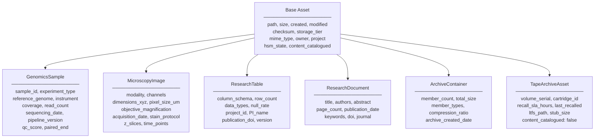
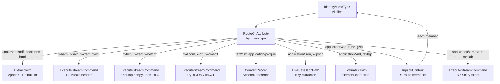

# File Formats

## Complete File Format Inventory

This page documents all file formats expected across the 20PB estate on IBM Storage Scale and IBM Tape, with the metadata extractable from each and the NiFi extraction approach.

---

## Genomics & Bioinformatics

| Format | Extension | Data Type | Primary Tier | Metadata Extractable | NiFi Extraction Approach |
|---|---|---|---|---|---|
| **FASTQ** | `.fastq`, `.fq`, `.fastq.gz` | Unstructured sequences | Scale (hot) | Read count, quality scores, instrument ID, run ID, sample ID from header | Custom `ExecuteScript` (Python/Groovy) + header parse |
| **FASTA** | `.fasta`, `.fa`, `.fna` | Unstructured sequences | Scale / Tape | Sequence count, organism, contig names | Header line parse |
| **BAM** | `.bam` | Binary semi-structured | Scale | Sample ID, reference genome, read group, mapping stats via SAMtools | `ExecuteStreamCommand` → `samtools view -H` |
| **SAM** | `.sam` | Text semi-structured | Scale | Same as BAM | Text header parse |
| **CRAM** | `.cram` | Binary semi-structured | Scale / Tape | Same as BAM, compressed | `ExecuteStreamCommand` → SAMtools |
| **VCF** | `.vcf`, `.vcf.gz`, `.bcf` | Semi-structured | Scale | Sample names, reference, variant count, caller tool, contig list | Header parse of `##` lines |
| **GFF / GTF** | `.gff`, `.gff3`, `.gtf` | Structured text | Scale | Feature types, gene count, organism, assembly version | Line-count + field parse |
| **BED** | `.bed` | Structured text | Scale | Chromosome list, feature count, track info | First-line parse |
| **HDF5** | `.h5`, `.hdf5` | Binary structured | Scale | Dataset names, dimensions, attributes, data types | `ExecuteStreamCommand` → h5dump or h5py script |
| **Zarr** | `.zarr` (directory) | Chunked array | Scale | Array shape, dtype, compressor, dimension labels | `.zarray` / `.zattrs` JSON read |
| **DICOM** | `.dcm` | Binary structured | Scale / Tape | Patient (anonymised), modality, series, study date, pixel spacing | PyDICOM extract |
| **CZI** | `.czi` | Binary (Zeiss microscopy) | Scale / Tape | Channels, dimensions, objective, acquisition date | libCZI / AICSImageIO |
| **TIFF / BigTIFF** | `.tif`, `.tiff` | Binary image | Scale / Tape | Width, height, bit depth, compression, EXIF | ImageMagick `identify` or PIL |
| **OME-TIFF** | `.ome.tif` | Structured image | Scale | Full OME-XML metadata — channels, Z-stacks, timestamps, instrument | OME metadata XML parse |
| **BAI / CSI** | `.bai`, `.csi` | Index | Scale | Linked to parent BAM/CRAM — relationship inference | Relationship inference only |
| **Tabix index** | `.tbi` | Index | Scale | Linked to parent VCF — relationship inference | Relationship inference only |

---

## Research & Scientific Data

| Format | Extension | Data Type | Primary Tier | Metadata Extractable | NiFi Extraction Approach |
|---|---|---|---|---|---|
| **CSV / TSV** | `.csv`, `.tsv` | Structured | Scale | Column names, row count, delimiter, encoding, null rate | NiFi `CSVReader` controller service |
| **Excel** | `.xlsx`, `.xls` | Structured | Scale | Sheet names, column headers, row counts, author, date | Apache POI via `ExecuteScript` |
| **Parquet** | `.parquet` | Columnar structured | Scale | Schema, row count, compression, writer library | Apache Parquet tools / PyArrow |
| **Arrow / Feather** | `.arrow`, `.feather` | Columnar | Scale | Schema, row count, metadata map | PyArrow |
| **NetCDF** | `.nc`, `.nc4` | Structured array | Scale / Tape | Variables, dimensions, global attributes, time range | netCDF4-python |
| **JSON** | `.json`, `.jsonl` | Semi-structured | Scale | Key names, nesting depth, array sizes, schema inference | NiFi `JsonPathReader` |
| **XML** | `.xml` | Semi-structured | Scale | Root element, namespace, element count | NiFi `XMLReader` |
| **YAML / TOML** | `.yaml`, `.yml`, `.toml` | Semi-structured | Scale | Top-level keys, type structure | `ExecuteScript` |
| **SQLite** | `.db`, `.sqlite` | Structured binary | Scale | Table names, schema, row counts | SQLite CLI via `ExecuteStreamCommand` |
| **R data** | `.rds`, `.rda`, `.rdata` | Binary structured | Scale | Object class, dimensions, variable names | R script via `ExecuteStreamCommand` |
| **Jupyter Notebook** | `.ipynb` | JSON semi-structured | Scale | Cell count, kernel, language, imported libraries | JSON parse of `.ipynb` structure |
| **MATLAB** | `.mat` | Binary structured | Scale / Tape | Variable names, dimensions, class types | SciPy `loadmat` |

---

## Documents & Reports

| Format | Extension | Data Type | Primary Tier | Metadata Extractable | NiFi Extraction Approach |
|---|---|---|---|---|---|
| **PDF** | `.pdf` | Unstructured | Scale / Tape | Title, author, creation date, page count, extracted text | Apache Tika `DetectType` + content extraction |
| **Word** | `.docx`, `.doc` | Unstructured | Scale | Title, author, word count, creation date, tracked changes | Apache Tika |
| **PowerPoint** | `.pptx` | Unstructured | Scale | Title, author, slide count, creation date | Apache Tika |
| **Plain text** | `.txt`, `.log`, `.out` | Unstructured | Scale / Tape | Line count, encoding, first/last line timestamps | NiFi built-in |
| **Markdown** | `.md` | Unstructured | Scale | Heading structure, word count | Text parse |
| **HTML** | `.html` | Semi-structured | Scale | Title tag, meta tags, link count | Tika / JSoup |

---

## Archives & Containers

| Format | Extension | Type | Tier | NiFi Handling |
|---|---|---|---|---|
| **Gzip** | `.gz` | Compressed | Scale / Tape | `UnpackContent` → decompress → re-route members through pipeline |
| **BZ2** | `.bz2` | Compressed | Scale / Tape | `UnpackContent` → decompress → re-route |
| **BGZF** | `.bgz` | Block-gzip (bioinformatics) | Scale | Block-indexed — used by `.vcf.gz`, `.fastq.gz` — unpack then parse |
| **TAR** | `.tar`, `.tar.gz` | Archive container | Scale / Tape | `UnpackContent` → list members → re-route each member individually |
| **ZIP** | `.zip` | Archive container | Scale / Tape | `UnpackContent` → list members → re-route |
| **7-Zip** | `.7z` | Archive | Tape | Custom processor wrapping 7z CLI |

!!! info "Archive Handling Pattern"
    All archive/compressed formats follow the same NiFi pattern: `UnpackContent` → members re-enter the pipeline at the `IdentifyMimeType` processor. This means archives within archives are handled recursively up to a configurable depth limit.

---

## Metadata Schema per Asset Category

---

## IBM Tape — Special Handling

Tape-resident files require a two-phase cataloguing approach:

```mermaid
flowchart LR
    subgraph PHASE1["Phase 1 — Immediate on Crawl"]
        P1A["Detect stub file\nxattr: hsm.state = MIGRATED"]
        P1B["Extract filesystem metadata\npath, size, timestamps, HSM xattrs"]
        P1C["Query IBM Spectrum Archive API\nvolume serial, cartridge ID, LTFS path"]
        P1D["Create IKC asset record\nstatus: metadata-only\ncontent_catalogued: false"]
    end

    subgraph PHASE2["Phase 2 — Deferred Content Extract"]
        P2A["Airflow DAG triggers\nscheduled batch recall window"]
        P2B["Submit sequential HSM recall\ngroup by cartridge for efficiency"]
        P2C["NiFi detects recalled file\nxattr: hsm.state = RESIDENT"]
        P2D["Run format-specific extraction\nsame pipeline as hot files"]
        P2E["Update IKC asset record\ncontent_catalogued: true\nfull metadata populated"]
    end

    P1A --> P1B --> P1C --> P1D
    P1D -->|scheduled| P2A
    P2A --> P2B --> P2C --> P2D --> P2E
```

!!! warning "Sequential Tape Recall"
    Always group tape recalls **by cartridge** and process sequentially. Random access across cartridges causes excessive tape seeking and dramatically reduces throughput. The Airflow `tape-recall-batch` DAG handles this by sorting pending recalls by `volume_serial` before submitting.

---

## NiFi Processor Coverage Map

