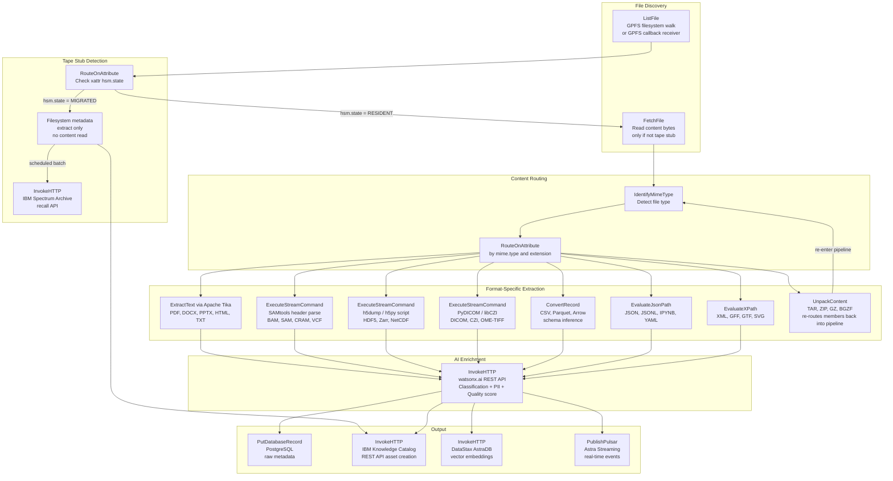
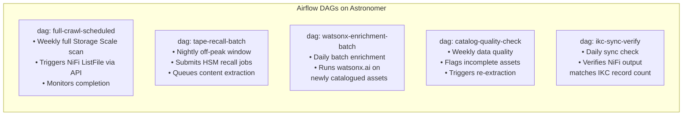

# Ingestion Pipeline

## Apache NiFi + Astronomer Airflow

The ingestion layer uses two complementary tools that operate at different levels — NiFi as the **data plane** and Airflow as the **control plane**.

---

## Why Two Tools?

```mermaid
flowchart LR
    subgraph NIFI_ROLE["Apache NiFi — Data Plane"]
        N1["Moves actual file bytes\nand metadata"]
        N2["Event-driven reaction\nto new files"]
        N3["Built-in backpressure\nand flow control"]
        N4["Per-file provenance\nchain tracking"]
        N5["Handles binary formats\nBAM, HDF5, DICOM natively"]
    end

    subgraph AIRFLOW_ROLE["Astronomer Airflow — Control Plane"]
        A1["Schedules WHEN\nNiFi runs full re-scans"]
        A2["Orchestrates watsonx.ai\nbatch enrichment jobs"]
        A3["Manages tape recall\nbatch windows"]
        A4["Coordinates downstream\npipeline dependencies"]
        A5["Monitors pipeline\nhealth and SLAs"]
    end

    AIRFLOW_ROLE -->|Triggers| NIFI_ROLE
    NIFI_ROLE -->|Events/metrics| AIRFLOW_ROLE
```

!!! success "Key Principle"
    NiFi and Airflow are **complementary, not competing**. NiFi handles individual file-level parallelism at scale — a concept Airflow has no equivalent for. Airflow handles DAG-level workflow coordination — a concept NiFi is not designed for.

---

## NiFi vs Airflow Detailed Comparison

| Dimension | Apache NiFi | Astronomer Airflow |
|---|---|---|
| **Primary purpose** | Real-time data flow, routing, transformation | Workflow orchestration — scheduling DAGs |
| **Data handling** | Moves actual file bytes and metadata natively | Orchestrates tasks that move data — does not move data itself |
| **Filesystem crawling** | Native `ListFile`, `FetchFile`, `GetSFTP` processors | No native filesystem crawler — requires custom operators |
| **Backpressure and flow control** | Built-in — queues, prioritisation, rate limiting | Not applicable — Airflow does not buffer data |
| **Content extraction** | Native `ExtractText`, `IdentifyMimeType`, Apache Tika | Requires custom Python operators per file type |
| **Event-driven triggers** | Yes — reacts to new files, GPFS callbacks | Primarily schedule-based (cron); event-driven is complex |
| **20PB scale** | Cluster mode — linear horizontal scale, millions of files/day | Viable but requires significant custom operator engineering |
| **Low-latency incremental** | Sub-minute on new file arrival | Minimum 30s scheduler loop; not truly event-driven |
| **Tape stub detection** | Reads filesystem xattr natively — no recall triggered | Cannot distinguish stub vs hot file without custom operator |
| **Built-in data provenance** | Yes — per FlowFile provenance chain | No — lineage must be captured externally |
| **OpenShift deployment** | StatefulSet + ZooKeeper — fully on-prem | Astronomer Software — fully on-prem operator available |
| **IBM ecosystem fit** | OSS — integrates via HTTP/REST | OSS — integrates via HTTP/REST |

---

## NiFi Pipeline Architecture

---

## Airflow DAG Design

---

## NiFi Cluster Sizing

| Parameter | Value | Rationale |
|---|---|---|
| NiFi nodes | 10 | Parallel processing across 20PB |
| ZooKeeper nodes | 3 | Cluster state quorum |
| FlowFile repo per node | 500 GB SSD | Fast local FlowFile queuing |
| Content repo per node | 2 TB | Temporary content buffer |
| Target crawl throughput | ~700 TB/day | 20PB in 30 days |
| Max concurrent tasks per node | 20 | Tunable per processor |

!!! tip "Post-Crawl Scale Down"
    After the initial 20PB crawl is complete, the NiFi cluster can be scaled down to 3 nodes for steady-state event-driven incremental updates, reducing resource consumption significantly.

---

## Astronomer Airflow Deployment Note

!!! warning "Astronomer Software — Not Astronomer Cloud"
    This architecture requires **Astronomer Software** (self-hosted on OpenShift via the Astronomer operator) — **not** Astronomer Cloud (SaaS).

    Astronomer Cloud would introduce an external SaaS dependency and potential data residency concerns for genomics and research data. Astronomer Software runs entirely within the OpenShift cluster with no outbound data transmission.
