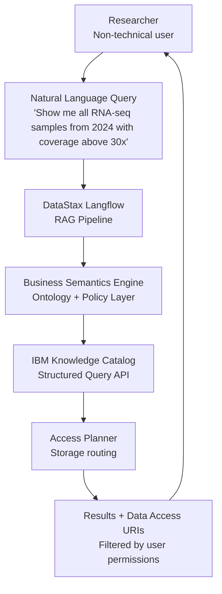
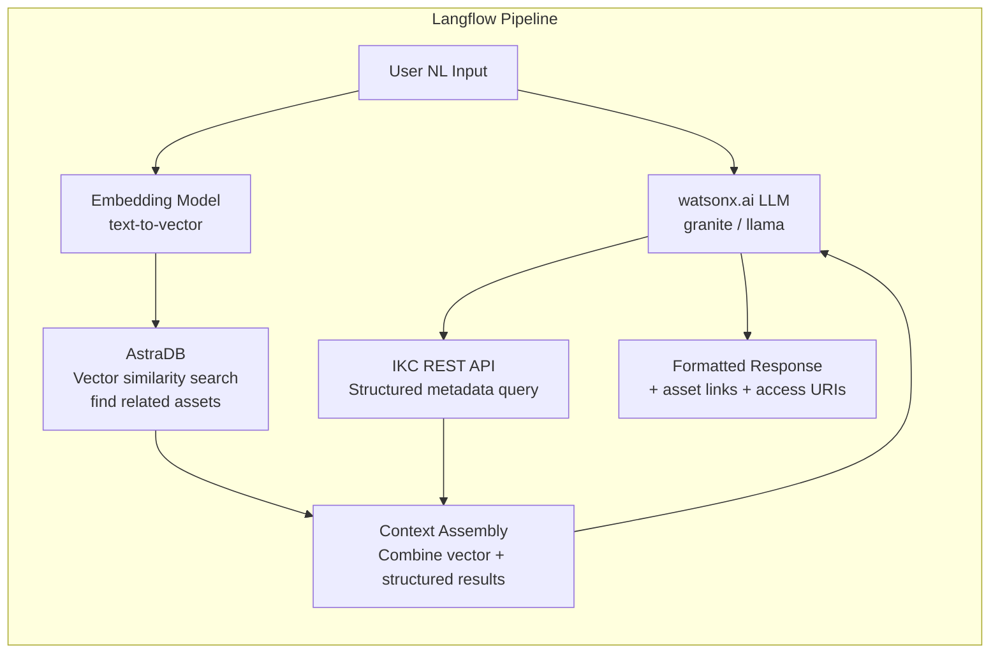
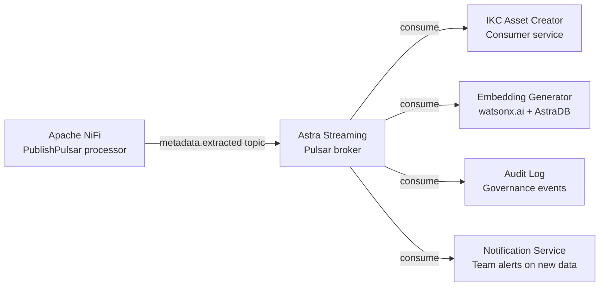
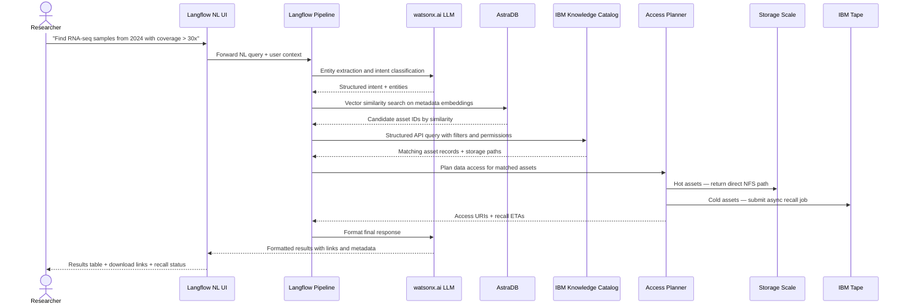

# Semantic Layer

## DataStax + watsonx.ai Context Layer

The semantic layer transforms IBM Knowledge Catalog from a metadata store into an **AI-ready, natural language-queryable data fabric**. It is powered by DataStax components available in **IBM watsonx.data Premium**.

---

## What the Semantic Layer Does



### Query Translation Example

```
Input:   "RNA-seq samples from 2024 with coverage > 30x"

Entity Recognition:
  "RNA-seq"    → file_type: fastq OR bam, experiment_type: RNA-seq
  "samples"    → asset_type: genomics_sample
  "2024"       → sequencing_date: 2024-01-01 to 2024-12-31
  "coverage"   → metadata field: coverage
  "> 30x"      → filter: coverage > 30

Permission Enrichment:
  user: researcher_a@org.com
  team: genomics-team-a
  → add filter: catalog_domain = genomics-team-a

Output Structured Query:
  asset_type=genomics_sample
  AND experiment_type=RNA-seq
  AND sequencing_date BETWEEN 2024-01-01 AND 2024-12-31
  AND coverage > 30
  AND catalog_domain = genomics-team-a
```

---

## DataStax Components in watsonx.data Premium

!!! info "IBM Acquisition"
    DataStax was acquired by IBM in 2024 and is now part of **IBM watsonx.data Premium**. All DataStax components below are available as IBM-native deployments on OpenShift.

### DataStax Langflow — NL Pipeline Builder

Langflow is a visual RAG (Retrieval Augmented Generation) pipeline builder that powers the natural language interface.



**Key capabilities:**
- Visual no-code pipeline editing — maintainable without AI assistance
- Connects to watsonx.ai models natively
- Dual retrieval: vector similarity (AstraDB) + structured query (IKC API)
- Permission-aware — applies user context to every query

---

### DataStax AstraDB — Vector Store

AstraDB replaces the need for a standalone Milvus deployment. It provides:

| Capability | Detail |
|---|---|
| **Storage** | Vector embeddings of file content and metadata |
| **Search** | Approximate Nearest Neighbour (ANN) — sub-second semantic similarity |
| **Use cases** | "Find files similar to this one", "Show related genomics studies" |
| **Index type** | HNSW (Hierarchical Navigable Small World) |
| **Integration** | Native Langflow connector, watsonx.ai embedding output |
| **Deployment** | Cassandra-backed StatefulSet on OpenShift |

**Embedding strategy by file type:**

| Asset Type | What Gets Embedded | Embedding Model |
|---|---|---|
| Genomics samples | Sample metadata JSON + experiment summary | watsonx.ai `slate-30m-english-rtrvr` |
| Research documents | Extracted text content (via Tika) | watsonx.ai `slate-30m-english-rtrvr` |
| Microscopy images | EXIF + OME metadata summary | watsonx.ai `slate-30m-english-rtrvr` |
| Tabular datasets | Column names + schema description | watsonx.ai `slate-30m-english-rtrvr` |

---

### DataStax Astra Streaming — Event Backbone

Astra Streaming (Apache Pulsar) replaces the need for a standalone Kafka deployment:



**Topics:**

| Topic | Producer | Consumers |
|---|---|---|
| `metadata.extracted` | NiFi | IKC asset creator, embedding generator |
| `asset.created` | IKC | Audit log, team notifications |
| `tape.recall.requested` | Access Planner | IBM Spectrum Archive recall job |
| `tape.recall.completed` | Recall monitor | NiFi content extraction trigger |
| `governance.policy.applied` | IKC | Audit log, compliance reporting |

---

### DataStax Cassandra — Distributed Metadata Store

Cassandra provides high-throughput, low-latency metadata key-value lookups that complement PostgreSQL for specific access patterns:

| Use Case | Why Cassandra (not PostgreSQL) |
|---|---|
| File path → asset ID lookup | Billions of rows, single-key lookup — Cassandra excels here |
| Crawl state tracking | Write-heavy, append-only — Cassandra's strength |
| Real-time metadata event log | Time-series insert pattern — Cassandra optimised |
| Asset tag index | Wide-column model ideal for sparse tag sets |

---

## Natural Language Query — End-to-End Flow



---

## Business Semantics — Domain Ontology

The ontology is maintained as configuration in Langflow — editable without code:

```yaml
genomics_ontology:
  terms:
    RNA-seq:
      maps_to: [experiment_type:RNA-seq, file_type:fastq, file_type:bam]
    WGS:
      maps_to: [experiment_type:WGS, file_type:bam, file_type:cram]
    quality_score:
      maps_to: metadata.qc_score
    sample:
      maps_to: asset_type:genomics_sample
    coverage:
      maps_to: metadata.coverage
    related_to:
      maps_to: [same_project, same_experiment_id]
    high_coverage:
      maps_to: "metadata.coverage > 30"
    recent:
      maps_to: "sequencing_date > NOW() - INTERVAL 1 YEAR"

  policies:
    multi_tenancy:
      always_filter_by: catalog_domain = user.team
    pii_masking:
      hide_fields: [patient_id, donor_id, personal_identifiers]
    access_control:
      check_permission: IKC asset-level access policy
```
