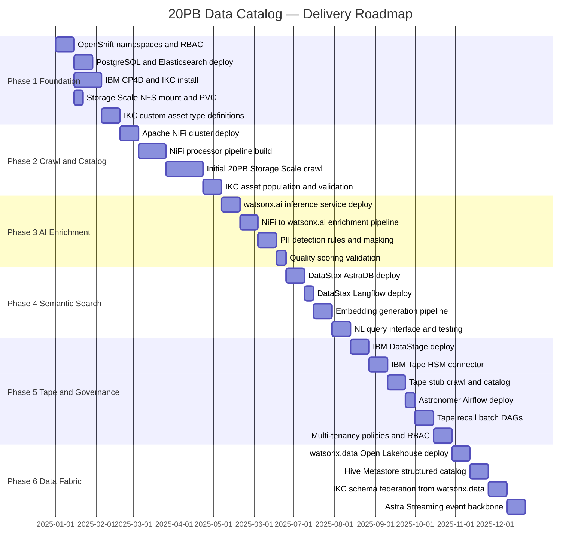

# Phased Roadmap

## Delivery Phases

The 20PB Data Catalog platform is delivered in six phases. Each phase is independently deployable and delivers incremental value. Phase 1 through 3 are the critical path for the core cataloguing requirement.

---

## Phase Overview

---

## Phase Detail

### Phase 1 — Foundation

**Goal:** Establish the OpenShift platform foundation with IBM Knowledge Catalog installed and Storage Scale connected.

**Deliverables:**

- [ ] OpenShift namespaces created: `data-catalog-infra`, `data-catalog-core`, `data-catalog-ingest`, `data-catalog-ai`
- [ ] RBAC policies applied per namespace
- [ ] PostgreSQL StatefulSet deployed and healthy
- [ ] Elasticsearch StatefulSet deployed and healthy
- [ ] IBM Cloud Pak for Data (CP4D) installed via operator
- [ ] IBM Knowledge Catalog installed and accessible
- [ ] Storage Scale NFS PersistentVolume mounted and verified
- [ ] IKC custom asset types defined: `GenomicsSample`, `MicroscopyImage`, `ResearchTable`, `ResearchDocument`, `TapeArchiveAsset`
- [ ] IKC governance policies: data domains, team roles, PII classification rules

**Success Criteria:** IKC UI accessible, custom asset types visible, Storage Scale files accessible from an OpenShift pod.

---

### Phase 2 — Crawl & Catalog

**Goal:** Perform the initial 20PB filesystem crawl on IBM Storage Scale and populate IKC with filesystem-level metadata for all files.

**Deliverables:**

- [ ] Apache NiFi cluster deployed (10 nodes) with ZooKeeper
- [ ] NiFi processors configured: `ListFile`, `FetchFile`, `IdentifyMimeType`, `RouteOnAttribute`
- [ ] Format-specific extraction processors configured (Tika, SAMtools, h5dump, PyDICOM)
- [ ] NiFi → IKC REST API output processor configured
- [ ] Initial full crawl executed and monitored
- [ ] IKC asset count validated against expected file count
- [ ] NiFi provenance chain verified

**Success Criteria:** All Storage Scale files have an IKC asset record with filesystem metadata. Search returns results in IKC UI.

---

### Phase 3 — AI Enrichment

**Goal:** Enrich all catalogued assets with watsonx.ai-powered classification, quality scoring, and PII detection.

**Deliverables:**

- [ ] watsonx.ai inference service deployed on OpenShift
- [ ] NiFi enrichment processor added: `InvokeHTTP` → watsonx.ai classification API
- [ ] Auto-categorisation labels applied to all assets
- [ ] Quality scores (`qc_score`) populated per asset
- [ ] PII detection rules configured — patient IDs, donor identifiers flagged
- [ ] PII-flagged assets masked in IKC per governance policy
- [ ] Relationship inference — BAM linked to VCF, samples linked to projects

**Success Criteria:** All assets have classification tags, quality scores, and PII masking applied where applicable.

---

### Phase 4 — Semantic Search

**Goal:** Enable natural language querying and semantic similarity search over the catalog.

**Deliverables:**

- [ ] DataStax AstraDB deployed and healthy
- [ ] DataStax Langflow deployed and accessible
- [ ] Embedding generation pipeline: NiFi → watsonx.ai embedding model → AstraDB
- [ ] Langflow RAG pipeline configured with IKC API connector
- [ ] Domain ontology loaded into Langflow (genomics terms, research terms)
- [ ] NL query interface tested with representative queries
- [ ] Permission-aware filtering validated (team isolation in NL results)

**Success Criteria:** Researchers can query the catalog in plain English and receive accurate, permission-filtered results with access URIs.

---

### Phase 5 — Tape Integration & Governance

**Goal:** Extend the catalog to IBM Tape, implement full multi-tenancy, and add orchestration via Airflow.

**Deliverables:**

- [ ] IBM DataStage deployed via CP4D operator
- [ ] IBM Tape HSM connector configured in NiFi
- [ ] Tape stub detection logic deployed (`xattr hsm.state` routing)
- [ ] All tape stub files catalogued in IKC with `TapeArchiveAsset` metadata
- [ ] IBM Spectrum Archive API integrated for volume/cartridge metadata
- [ ] Astronomer Airflow (Software) deployed via operator
- [ ] Airflow DAGs created: `full-crawl-scheduled`, `tape-recall-batch`, `watsonx-enrichment-batch`, `catalog-quality-check`
- [ ] Multi-tenancy RBAC validated — team A cannot see team B's data
- [ ] DataStage lineage flowing into IKC for structured data pipelines

**Success Criteria:** Tape-resident files visible in IKC. Batch recall jobs running nightly. Multi-tenant isolation verified.

---

### Phase 6 — Data Fabric (Optional)

**Goal:** Add watsonx.data Open Lakehouse for structured data query federation and Astra Streaming for real-time event-driven catalog updates.

**Deliverables:**

- [ ] IBM watsonx.data deployed via IBM operator
- [ ] Hive Metastore configured for Parquet/Iceberg/CSV assets on Storage Scale
- [ ] watsonx.data schema sync into IKC — structured tables visible in IKC UI
- [ ] DataStax Astra Streaming deployed
- [ ] NiFi `PublishPulsar` processor replacing direct HTTP API calls for high-volume events
- [ ] Event topics configured: `metadata.extracted`, `asset.created`, `tape.recall.*`

**Success Criteria:** SQL queries via watsonx.data return results visible in IKC. Real-time metadata events flowing through Astra Streaming. All catalog updates event-driven.

---

## Risk Register

| Risk | Severity | Likelihood | Mitigation |
|---|---|---|---|
| 20PB initial crawl exceeds 30-day target | High | Medium | 10-node NiFi cluster; prioritise hot Storage Scale data; Tape deferred to Phase 5 |
| Tape recall latency blocks catalog ingestion | High | Low | Stub-first catalog approach — content extraction deferred, never blocks |
| watsonx.ai misclassification of rare genomic formats | Medium | Medium | Human-in-loop review workflow in IKC; configurable confidence threshold |
| PostgreSQL scaling at billion-file metadata volume | Medium | Low | Table partitioning by project/year; Cassandra for high-frequency KV lookups |
| CP4D / IKC operator upgrade complexity | Medium | Medium | Pin operator versions; tested upgrade path in non-prod first |
| GPFS NFS performance under 10-node NiFi parallel load | High | Medium | Test GPFS NFS throughput in Phase 1; tune NiFi max concurrent tasks |
| OpenShift resource contention during initial crawl | Medium | Medium | Crawl runs in dedicated `data-catalog-ingest` namespace with resource quotas |
